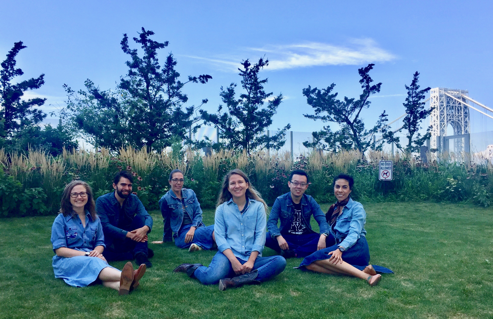

<!-- ### About our lab -->

 

Our lab lives in the [Environmental Health Sciences](https://www.mailman.columbia.edu/academics/departments/environmental-health-sciences-ehs){target="_blank"} Department at [Columbia University's](https://www.columbia.edu/){target="_blank"} [Mailman School of Public Health](https://www.mailman.columbia.edu/){target="_blank"}.  
Our research focuses on methodological issues in environmental epidemiology.
 
 

#### news

Our [Overview on Mixtures Methods paper](https://ehjournal.biomedcentral.com/articles/10.1186/s12940-019-0515-1){target="_blank"} was selected as one of the papers of the month for November 2019 by [NIEHS Environmental Factor](https://factor.niehs.nih.gov/2019/11/papers/dert/index.htm){target="_blank"}! Congratulations team!! 
 
Gibson EA&#8224;, N&#250;&#241;ez Y&#8224;, Abuawad A, Zota AR, Renzetti S, Devick KL, Gennings C, Golsmith J, Coull BA, Kioumourtzoglou M-A, _An Overview of Methods to Address Distinct Research Questions on Environmental Mixtures: An Application to Persistent Organic Pollutants and Leukocyte Telomere Length_, Environmental Health, 18(76), 2019  
<small>&#8224;The authors contributed equally</small>

Our paper was accepted as a poster at [NeurIPS 2019](https://nips.cc/Conferences/2019/){target="_blank"} (21% acceptance rate)! Congratulations Jeremiah!
 
_Accurate Uncertainty Estimation and Decomposition in Ensemble Learning_, by Jeremiah Z Liu, J Paisley, M-A Kioumourtzoglou, and BA Coull 
 
 

#### contact information

 
[Department of Environmental Health Sciences](https://www.mailman.columbia.edu/become-student/departments/environmental-health-sciences-ehs){target="_blank"}
 
[Columbia University Mailman School of Public Health](https://www.mailman.columbia.edu/){target="_blank"}
 
722 West 168th Street, #1104B
 
New York, NY 10032
 
 

_website last updated: `r format(Sys.Date(), "%m.%d.%Y")`_

