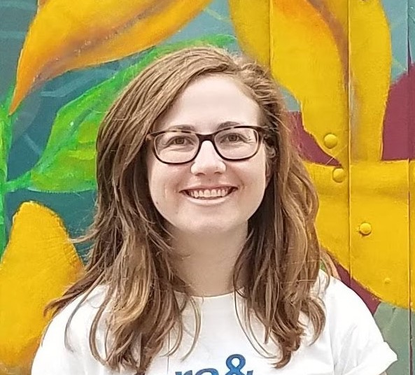
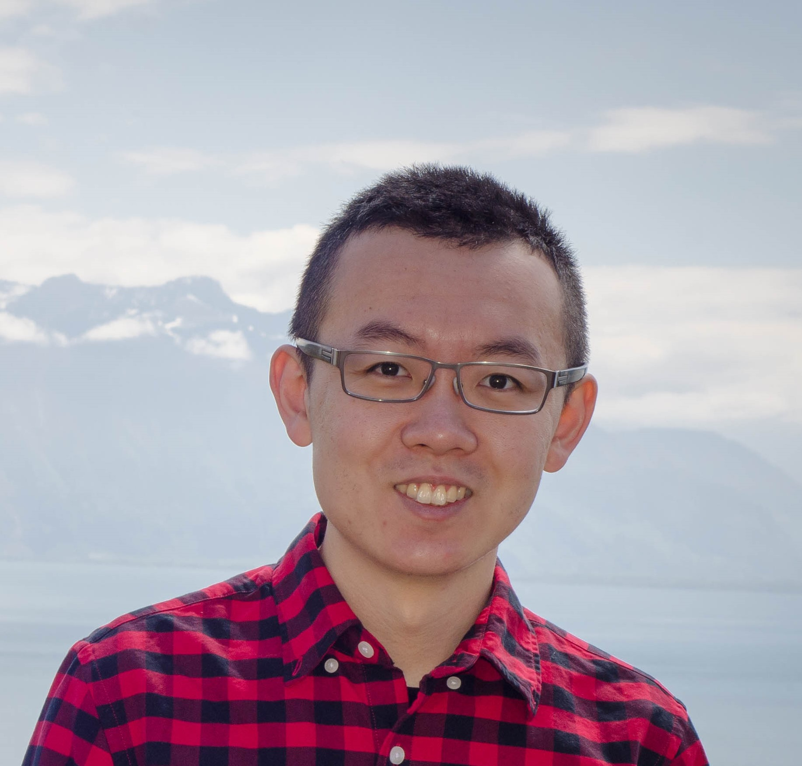
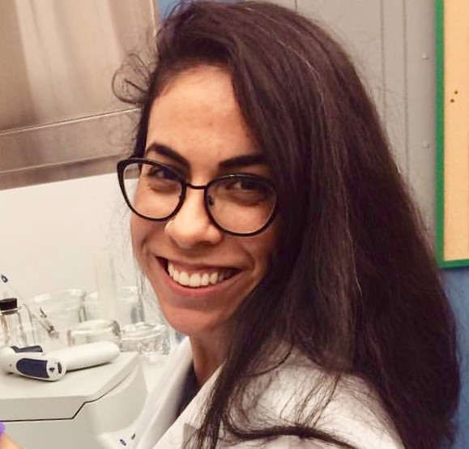
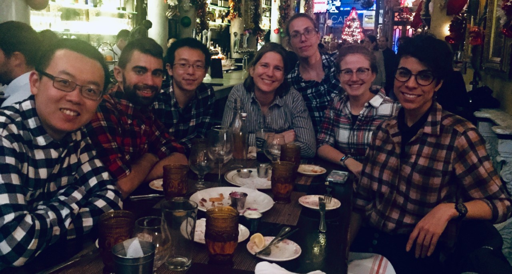

<center></center>

### mak

{ width=12.5% } [Marianthi-Anna Kioumourtzoglou](https://www.mailman.columbia.edu/people/our-faculty/mk3961){target="_blank"}, Assistant Professor 


### doctoral students

<div class="col2"> 

{ width=25% } [Lizzy Gibson](https://lizzyagibson.github.io){target="_blank"} 

{ width=25% } [Mike Z. He](https://mike-z-he.github.io/index.html){target="_blank"}  

{ width=25% } [Yanelli N<span>&#250;&#241;</span>ez](https://yanellinunez.github.io){target="_blank"}  
<br>

{ width=25% } [Sebastian Rowland](https://s-rowland.github.io/srowland.github.io/index.html){target="_blank"}  

{ width=25% }  [Jenni Shearston](https://jenni-shearston.github.io/){target="_blank"} 

</div>


### post-docs

{ width=12.5% }  [Robbie Parks](https://robbiemparks.github.io/){target="_blank"}, [Earth Institute](https://www.earth.columbia.edu/){target="_blank"} 

<br>


```{r setup, include=FALSE}
htmltools::tagList(rmarkdown::html_dependency_font_awesome())
```

<div class="expand collapsed" data-toggle="collapse" data-target="#grouppics" aria-expanded="false" aria-controls="grouppics">
### {width=15%} group pics <i class="fa fa-angle-double-down"></i>
</div>


<div class="collapse" id="grouppics">

A CA road trip in the 70's (Aug 2019, CUMC)

{ width=25% }
<br><br>

Flannel Night Out (Dec 2019, NYC)

{ width=50% }


</div>